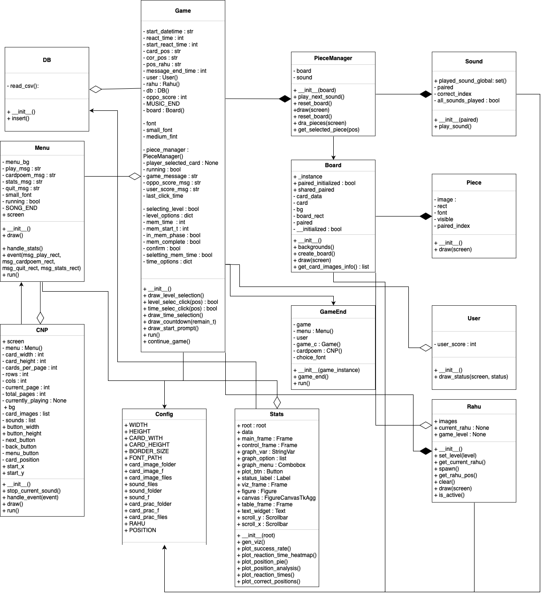

**Sweep that !**

1. **Project Overview**

    Sweep That! is an immersive memory-matching game that blends traditional Thai poetry with engaging gameplay. Players test their memory by matching beautifully designed cards featuring excerpts from classic Thai literary works such as นิราศภูเขาทอง (Nirat Phukhao Thong), ลิลิตตะเลงพ่าย (Lilit Taleng Phai), พระอภัยมณี (Phra Aphai Mani), and นิราศเมืองแกลง (Nirat Mueang Klaeng). The game features a streamlined 36-card layout for faster-paced matches, where players compete against the computer to collect all 18 cards assigned to their side. 

    This project’s game will contain 36 cards in total, 18 for each side of players. After the game ends it will show the stats of the player in this round along with the stats of the player all the round before and analyze it at which point you need to develop, such as you need to sweep the card more quickly! Or maybe you need to memorize the card and their position more correctly. 

    Example of the board : 

2. **Project Review**

    Card matching game : card matching game has a not so similar but useful system to Karuta game, so I can use this game’s project as a reference and develop it into thai Karuta card game ‘Sweep that!’. 

3. **Game Concept**

    Sweep That! reinvents the traditional Japanese Karuta card game with a uniquely Thai twist, blending fast-paced memory gameplay with the beauty of classic Thai poetry. Players engage in an exciting battle of wits, matching cards featuring iconic Thai literary works like นิราศภูเขาทong (Nirat Phukhao Thong), ลิลิตตะเลงพ่าย (Lilit Taleng Phai), พระอภัยมณี (Phra Aphai Mani), and นิราศเมืองแกลง (Nirat Mueang Klaeng). 

    Core Gameplay: 
    *36-Poem Card Deck:* A carefully curated selection of Thai poems replaces the original 50-card setup, optimized for balanced and strategic play. 
    *Head-to-Head Memory Duel:* Players compete against the computer to be the first to "sweep" all 18 of their assigned cards from the board. 
    *Audio-Visual Matching:* Listen to narrated poem excerpts and race to identify and select the corresponding card before your opponent. 
    *Two Distinct Modes:* 
    *Normal Mode:* Pure memory challenge, match poems against the clock. 
    *Hard Mode:* Features Rahu (ราหู), a mythical serpent that devours random position of the board, forcing players to rely on their memory as some part of the board is invisible. 

    The selling point of this game is the adaptation of Karuta to thai styles card game. This game is a great way to learn about Thai poetry while having fun and improving your reaction time.

    **UML**
    

        
    

4.  Object-Oriented Programming Implementation

| File | Class | Description |
|------|-------|-------------|
| **sweepthat_classes.py** | | |
| | `Board` | this class will be used to create the board of the game and place the cards and return the card info for data collection. |
| | `Sound` | Manages all poem audio files and sound playback |
| | `Piece` | this class store all card information and draw the cards on the board. |
| | `User` | Tracks and displays player score (18 to 0) |
| | `Rahu` | Manages Hard Mode (position tracking, spawning, rendering) |
| | `PieceManager` | this class is responsible for managing the card and board, resetting the board for new games, playing the next sound and returning the index of the correct card. |
| **sweepthat_config.py** | | |
| | `Config` | Config class will store all basic game data such as size of the board, size of the card or the card’s thai poem to use in Card class.(board/card sizes, poem references, etc.) |
| **sweepthat_game.py** | | |
| | `Game` | Main game controller with core loop and state management along with a lot of helper functions such as draw_countdown that will draw the memorized time that user selects, draw_level_selection that will draw the level for the user to select. |
| **game_end.py** | | |
| | `GameEnd` | Handles win/lose screens and post-game options (restart, menu, card & poem) |
| **sweepthat_menu.py** | | |
| | `Menu` | Main menu system with navigation (Play, Card & Poem, Stats, Quit) |
| **sweepthat_cardpoem.py** | | |
| | `CNP` | Manages the Card & Poem practice mode (card browsing, audio playback) |
| **sweepthat_stats.py** | | |
| | `Stats` | Tkinter-based analytics dashboard (Table, graphs: histograms, heatmaps, pie charts) |
| **sweepthat_db.py** | | |
| | `DB` | Handles all data operations (CSV logging, retrieval for stats) |

For all of the images and sound, it will be stored in 1. Card images folder 2. Sound folder 3.backgrounds 4.asset

5. Algorithms Involved

    Rule-based Logic : This game uses a rule-based logic algorithm based on traditional Karuta game’s logic.
    Event-driven mechanics : Karuta game is the reaction game which really fits with event-driven mechanics, with actions triggered by events as the reciter reading a poem, a player clicking a card, or the game reaching its end. These events are handled using event listeners and callback functions.

**Statistical Data (Prop Stats)**
6. Data Features

In the ‘database.csv’ csv file, we will track 5 features.
Date - start time
<react_time> time that user use to click the card ( If the opponent(computer) is the one who click it, the data will be 0.00)
<card_pos> position of the correct card ( top left, middle left, bottom left, top right, middle right, bottom right)
<cor_idx> index of the correct card.
<clicked_pos> position of the clicked card ( same as position of the card).
<clicked_idx> index of the clicked card.
<rahu_pos> position of the rahu ( same as position of the card)
<result> Result of that round (Correct, Incorrect or Opponent Correct.)

From the above, the data that we have tracked will be calculated into the user analysis to make the user improve themselves ex.If the position of the card often on the top right, means that the user needs to pay attention on the other side of the board more, or if the position of rahu is the same as position of the correct card and the result of user is correct means that user is can really remember the position of the card.

7. Data Recording Method

All the game’s statistical data will be stored in a CSV file with date and start time, which can be used to calculate the average time that user clicks the card in each round.

8. Data Analysis Report
Statistical Measures
Mean and Median: Calculate the average time to sweep cards and total time per round to understand typical player behavior.
Frequency Distribution: Analyze how often each poem is quickly or slowly clicked to identify patterns in player knowledge.

Presentation
Histogram : 
The frequency of the correct result in hard mode (RAHU appear) compared to the result in normal mode (no RAHU appear)’
Specific card and the frequency that user can’t click that card correctly (click another card or can’t click the card in time at all)
Heat map : Represent the top 9 longest reaction times that users use.
Table : Show the position of RAHU vs the position of the correct card and success rate.
Line graph : Compare the average time that the user sweeps in each round.
Pie chart : Position of the correct card that users often overlook.

9. 
| Graph Name | Feature Name | Description | Graph Type | X-axis | Y-axis |
|------------|--------------|-------------|------------|--------|--------|
Frequency of correct result in hard mode compare to normal mode | rahu_pos, result | Comparison of success rates between modes. | Histogram | Rahu_pos (hard mode and normal mode) | Frequency | 
Top 9 Longest time used to click a card. | Clicked_idx , react_time, result | To see which card user uses the longest time to click. | Heatmap  | -  | - | 
Most Incorrect Click Position | result, cor_pos | To see which position users usually overlook. | Pie chart | -  | - | 
Position of rahu compare to position of clicked card and success rate | rahu_pos, cor_pos, result | To see if the position of rahu affects the success rate of users. | Table | Rahu_pos, Cor_pos, Success_rate | - | 
All the sweep times. | date_start time, react_time | To see the average times that users use in each round and make the user know their development.  | Line graph | date_start time (as round 1- 1, 1 - 2 and so on) | react_time | 
Card that user doesn’t click correctly | Cor_idx, click_idx | To see how much that user clicks the specific card incorrectly. | Histogram | cor_idx | Frequency | 
---

10. 
---
| Feature Name | What can this data be used for? Why is it good to have this data? | How will you obtain 50 values of this feature data? | Which variable and which class will you collect this from? | How will you display this feature data (via summarization statistics or via graph)? |
|--------------|---------|-------------------|-----------------------|----------------------|
Date - Start time | The date - start time will be stored to be the primary key so we can know what's happening in the round since we collect the data as soon as the user clicks the card and we also have a lot of rounds until the user or the computer can click 18 cards. | By playing the game until the data is enough to calculate. | Collect from self.start_datetime in Game class | It will display along with the average time that users use to click the card and the time that users use to memorize the card. | 
Time users use to click the card. | The time that the player uses to find the right card and click it can be used to analyse if they are faster or slower or if the user can’t remember the poem or the position so they use a lot more time than the other card. | By playing the game until the data is enough to calculate. | Collect from self.time_round in User class | The data will be represented in a line graph to compare all the time that the user uses. | 
Index of the correct card. | The index of the correct card to compare with the index of the clicked card  to see if the user clicks the incorrect card, does it have the similar first words? Or if it has a similar sound? | By playing the game until the data is enough to calculate. | Collect from self.piece_manager.sound.correct_index in PieceManager class | The index will be used to find the poem and compare it to the poem of the clicked card. | 
Position of the correct card. | Position of the correct card to compare to the position of the clicked card to see that the user may have clicked the wrong card because it's located nearby. | By playing the game until the data is enough to calculate. | Collect from ‘self.card_data’ in Board class (self.cor_pos) | The position of the correct data will be used to represent in the table to check with the position of the RAHU. | 
Index of the clicked card | The index can tell which card the user tends to remember the poem the most and which card that user tends to forget the poem. | By playing the game until the data is enough to calculate. | Collect from self.player_selected_card in Game clas | The cards  will be displayed as a pie chart showing which card that the user tends to click the most (which means that the user can remember that card well) and also used to find the poem and compare it to the correct poem index. | 
Position of the clicked card | To know which part of the board that user pays attention to or which part that user often overlooks. | By playing the game until the data is enough to calculate.
Collect from ‘self.card_data’ in Board class (self.card_pos) | The card’s position data will display as a pie chart with ‘top left’, ‘top right’, ‘bottom left’, and ‘bottom right’ with the percentage that the user clicked the card on that side. Along with the suggestion such as “Maybe pay more attention to the left side’s card!” | 
Position of Rahu | To know the position that the user can’t see, to check if the user can remember the position even though they can’t see the card. | By playing the game until the data is enough to calculate. | Collect from self.get_rahu_pos() in Rahu Class (self.pos_rahu) | The position of rahu can also be used to check if the user played the normal mode or hard mode and the data will also be displayed in the table. | 
Result | To know if the user clicks the card correctly or not. | By playing the game until the data is enough to calculate. | Collect from ‘result’ | This data feature will help the other data to display such as pie chart of the incorrect position. The data will need to filter out the correct position since we only want the incorrect one. This is where result data will be used | 
---

11. Document version
Version: 5.0 (final version)
Date: 11 May 2025